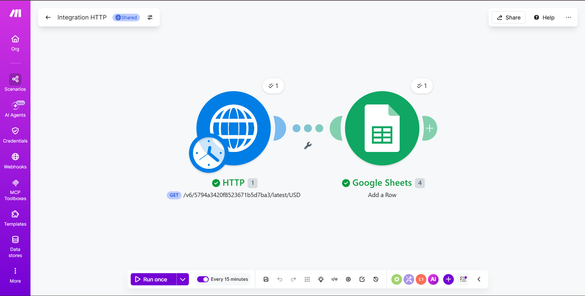
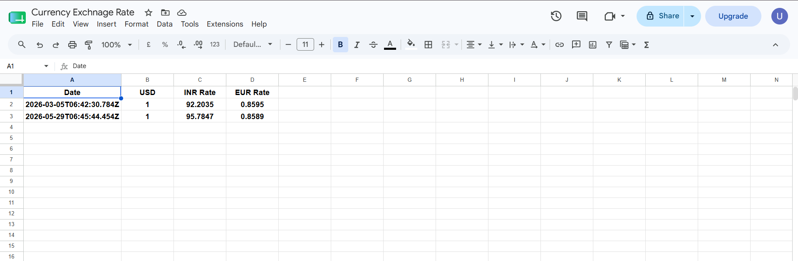

# 💱 USD to INR Exchange Rate Automation

An automated pipeline that fetches the live USD to INR 
exchange rate and updates a Google Sheet in real time — 
eliminating the need for manual lookups.

---

## 💡 Problem Statement

Currency exchange rates fluctuate daily. Manually 
checking and recording the USD to INR rate is 
time-consuming and prone to being outdated. This 
automation solves that by fetching and storing the 
latest rate automatically.

---

## ⚙️ How It Works

1. **Trigger** — Make.com scenario runs on a schedule
2. **HTTP Request** — Calls the Exchange Rate API 
   to fetch the current USD to INR conversion rate
3. **Data Parsing** — Extracts the exact rate value 
   from the API response
4. **Google Sheets Update** — Automatically writes 
   the latest rate into a Google Sheet with timestamp

---

## 🔧 Workflow

---

## 📊 Output

The Google Sheet is updated automatically with:
- Current USD → INR exchange rate
- Timestamp of last update

---

## 🛠️ Tools Used

- **Make.com** — automation and workflow builder
- **Exchange Rate API** — live currency data source
- **Google Sheets** — data storage and output
- **HTTP Module** — API connection and data extraction

---

## 🎯 Key Concepts Demonstrated

- REST API integration
- No-code automation pipeline
- Real-time data extraction
- Automated data entry into spreadsheets
- Scheduled workflow execution

---

## 🔗 View Workflow

[View the Make.com scenario here](https://eu1.make.com/public/shared-scenario/yn9WUEnKPuB/integration-http)
